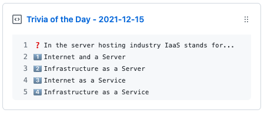

<p align='center'>
  
  <h1 align="center">trivia-box</h1>
  <p align="center">💻 Update a gist to contain a daily trivia question from Open Trivia DB</p>
  <p align="center">
    
    
  </p>
</p>

## 🎒 Prep Work

1. Create a new public GitHub Gist (https://gist.github.com/)
2. Create a token with the `gist` scope and copy it. (https://github.com/settings/tokens/new)
3. Copy the `API token`

## 🖥 Project Setup

1. Go to your fork's `Settings` > `Secrets` > `Add a new secret` for each environment secret (below)

## 🤫 Environment Secrets

- **GH_TOKEN:** The GitHub token generated above.
- **GIST_ID:** The ID portion from your gist url:

  `https://gist.github.com/ChrisCarini/`**`ef9d16e87e0458fff84bf42c4e05894b`**.

  (Alternatively this can be put directly in `.github/workflows/trivia.yml` as it is public anyway.)

## 🤓 Hacking

### Getting Setup

```shell
python3 -m venv venv
source activate
pip install -r requirements.txt
```

### Saving Dependencies

```shell
source activate
pip-chill > requirements.txt
```

### Running linting and tests

```shell
isort main.py trivia_box.py test/ && \
mypy main.py trivia_box.py test/ && \
flake8 main.py trivia_box.py test/ && \
blue --check main.py trivia_box.py test/ && \
pytest test/
```